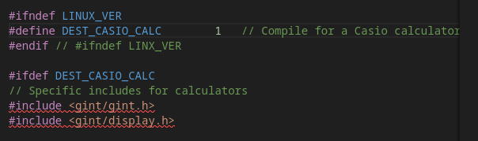
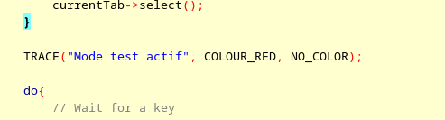
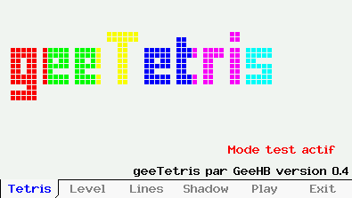

## *geeTetris* - Un jeu de *tetris* pour la Casio GRAPH90+E / FX-CG50

### Présentation

`geeTetris` est un jeu de type *tetris* pour la calculatrice Casio Graph90+E développé en C++ en utilisant `gint`.

Il offre différentes options : affichage de l'ombre de la pièce, démarrage avec un handicap de lignes 'sales', démarrage sur un niveau plus rapide. 
Et il permet de jouer avec la calculatrice en mode horizontal (position standard) ou en mode vertical.

### Informations de version

| Dépôt &nbsp;| https://gitea.planet-casio.com/Jhb/geeTetris |
|----- |-------------------------------------|
| **Date** | xxx nov. 2023 |
| **Version stable** | **0\.4** - branche `main` |
| **Dépendances** |  **Casio / gint** : `-lstdc++`|
| **Testé sur** | *Linux* (Fedora 38) avec `code::blocks`|
|| *Casio Graph90+e*  avec `gint`|

### Informations pour la compilation
#### Sources
Les sources sont organisés selon dossiers suivants :
* `src/` - Sources spécifiques à l'application;
* `src/shared` - Sources des objets pouvant être utilisés dans d'autres projets.

#### Constantes et définitions
La majorité des comportements sont régis par des constantes que l'on peut trouver pour laeur grande majorité dans deux fichiers distincts :
* `src/consts.h` - Contantes et définitions générales de l'application
* `src/shared/casioCalcs.h` - Constantes spécifiques aux calculatrices.

A défaut, les constantes, toujours en majusucules dans les sources, sout définis avec les objets qu'ils concernent. Par exemple `src/shared/tabs.h` propose les définitions liées aux onglets.

A défaut d'émulateur, tous les sources sont 100% fonctionnels en C/CPP ANSI. Ils peuvent donc être compilés dans un projet Windows (testé avec Visual Studio) ou sous Linux. Dans ce cas seuls les affichages ne seront pas effectués :).

Deux constantes permettent d'orienter la compilation :

| Constante | Fichier | Signification|
| --- | --- | --- |
| DEST_CASIO_CALC | `src/shared/casioCalcs.h` | Lorsque cette constante est définie, la compilation est orientée vers la calculatrice.|
|TRACE_MODE|`src/trace.h`| Active le mode trace. Lorsque ce mode est activé, la MACRO TRACE permet d'afficher du texte sur l'écran. Sinon, la MACRO est vide. **Attention :** ce mode n'est possible que lorsque la constante DEST_CASIO_CALC est définie.|

##### DEST_CASIO_CALC
La présence de cette constante conditionne la génération du code spécifique aux calculatrices Casio.

Par défaut le fichier `src/shared/casioCalcs.h`  lie la défintion de **DEST_CASIO_CALC** à l'absence de défintion de **LINUX_VER**. En français dans le texte : Si **LINUX_VER** n'est pas défini alors **CASIO_DEST_CALC** le sera :

Dans la configuration que j'utilise, mon compilateur sous Linux définit la variable **LINUX_VER**. Il invalide donc systématiquement **DEST_CASIO_CALC**.
Cela permet facilement de passer d'une configuration à l'autre sans rien modifier aux sources.
Rien n'empêche néanmoins d'utiliser une autre méthode ...

##### TRACE_MODE
Lorsque cette constante est définie, 2 fonctions sont activées sur la cauclatrice uniquement :
1. Activation de la macro *TRACE* qui permet d'afficher une ligne de texte à l'écran (et donc accessoirement de visiualiser le contenu d'une variable);
2. Activation de la fonction de capture d'écran. Dans ce mode, tous les affichages sont transférés via *USB* à l'utilitaire `fxlink`.

L'appel suivant de la macro *TRACE* demande l'affichage en rouge du texte "Mode test actif":

 

Lorsque la constante **TRACE_MODE** est définie, la ligne est effectivement affichée :

 

### Utilisation du clavier
#### A partir du menu principal
L'application se présente sous la forme d'onglets associés aux touches de contrôle. Les différents onglets permettent soit de modifier les paramètres de l'application soit de lancer l'application :

| Touche | Action |
|--------|--------|
|  | Affichage de l'**écran d'accueil**|
|  | Choix du **niveau de départ**. Plus le niveau est important et plus les pièces tomberont rapidement mais plus les lignes complètes raporteront de points. Par défaut le jeu commence au niveau 1.|
|  | Choix du **nombre de lignes 'sales'** affichées au démarrage de la partie. Par défaut il n'y a aucune ligne sur l'écran.|
|  | Affichage de **l'ombre de la pièce**. En l'absence d'ombre les lignes complètes raporteront plus de points. Les ombres sont affichées par défaut.|
|  | **Lancement** d'une partie avec les paramètres sélectionnés.|
|  | **Sortie** de l'application.|

#### Pendant la partie ...
Quel que soit le mode d'affichage choisi, vertical ou horizontal, les touches suivantes fonctionneront à l'identique à tout moment de la partie :

| &nbsp; &nbsp; &nbsp; &nbsp;&nbsp; &nbsp;&nbsp;&nbsp;&nbsp;Touches &nbsp; &nbsp; &nbsp;&nbsp; &nbsp; &nbsp; &nbsp;&nbsp; &nbsp; &nbsp; &nbsp;&nbsp; &nbsp; &nbsp; &nbsp;&nbsp; &nbsp; &nbsp; &nbsp;| Action |
|---------------|--------|
|  | **Changement du mode d'affichage**. Par défaut l'affichage est en mode horizontal (calculatrice en mode normal), un appui transformera instantanément les affichages du jeu vers le mode vertical. Compte tenu des dimensions de l'écran, en mode vertical les pièces peuvent être plus  larges. Le jeu est assurément plus jouable. Réciproquement suite à un second appui, il retourna au mode normal. |
|  | Pause du jeu. En mode **pause**, une image d'écran factice est affichée. Lorsque l'on appuie à nouveau sur la touche, le jeu reprend son cours.|
|  | Activation / désactivation du mode **capture**. |
|  | **Sortie** du jeu et retour au menu principal. |

#### Contrôles en mode horizontal

| Touche | Action |
|--------|--------|
|  | Déplacement de la pièce vers la **gauche** |
|  | Déplacement de la pièce vers la **droite** |
|  | **Descente** de la pièce d'un rang |
|  | **Rotation** de la pièce |
|  | Faire **tomber** la pièce le plus bas possible |

#### Contrôles en mode vertical

Les contrôles "suivent" le mouvement de la calculatrice :

| Touche | Action |
|--------|--------|
|  | Déplacement de la pièce vers la **gauche** |
|  | Déplacement de la pièce vers la **droite** |
|  | **Descente** de la pièce d'un rang |
|  | **Rotation** de la pièce |
|  | Faire **tomber** la pièce le plus bas possible |

### Copies d'écran

Ecran d'accueil de `geeTetris` :

Choix du nombre de ligne 'sales' à ajouter en début de partie :

Jeu en mode normal :

... la même partie continue en affichage vertical :

