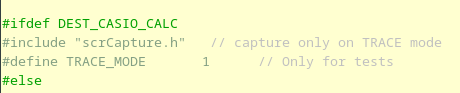
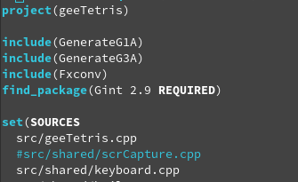
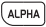
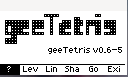
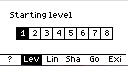
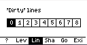
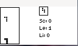
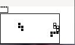

## *geeTetris* - Un jeu de *Tetris* pour les Casio GRAPH90+E / FX-CG50 et GRAPH35+E ii

### Présentation

`geeTetris` est un jeu de type *Tetris* pour les calculatrices Casio Graph90+E et Graph35+E ii développé en C++ en utilisant `gint`.

Il offre différentes options : affichage de l'ombre de la pièce, démarrage avec un handicap de lignes 'sales', démarrage sur un niveau plus rapide. 
Il permet aussi de jouer avec la calculatrice en mode horizontal (position standard) ou en mode vertical.

### Informations de version

| Dépôt &nbsp;| https://gitea.planet-casio.com/Jhb/geeTetris |
|----- |-------------------------------------|
| **Date** | 7 mars 2024 |
| **Version stable** | **0\.7.1** - branche `main` |
| **Dépendances** |  **Casio / gint** : `-lstdc++`|
| **Testé sur** | *Linux* (Fedora 39) avec `code::blocks`|
|| *Casio Graph90+E*  et Casio Grapg35+E ii avec `gint`|

### Informations pour la compilation
#### Sources
Les sources sont organisés selon dossiers suivants :
* `src/` : Sources spécifiques à l'application;
* `src/shared` : Sources des objets pouvant être utilisés dans d'autres projets.

#### Constantes de l'application
La majorité des comportements est régi par des constantes que l'on peut trouver pour leur grande majorité dans deux fichiers distincts :
* `src/consts.h` - Contantes et définitions générales de l'application
* `src/shared/casioCalcs.h` - Constantes spécifiques aux calculatrices.

A défaut, les constantes, toujours en majusucules dans les sources, sont définies avec les objets qui les concernent spécifiquement. Par exemple `src/shared/tabs.h` et `src/shared/tabs.cpp` proposent les définitions liées aux onglets.

Faute d'émulateur, tous les sources sont 100% fonctionnels en C/CPP ANSI. Ils peuvent donc être compilés dans un projet Windows (testé avec Visual Studio) ou sous Linux. Dans ce cas seuls les affichages ne seront pas effectués :).

#### Mode TRACE et capture d'écran
Il est possible de compiler les sources afin d'ajouter la fonction de capture d'écran (utilisation de *fxlink*). Pour cela, il faut :

* dans `src/shared/trace.h` : définir la constante TRACE_MODE :

* dans `CMakelists.txt` : Ajouter la compilation du module `src/shared/scrCapture.cpp`. La ligne est par défaut commentée :

Ne reste plus qu'à recompiler le ou les binaires.

### Utilisation du clavier
#### A partir du menu principal
L'application se présente sous la forme d'onglets associés aux touches de contrôle. Les différents onglets permettent soit de modifier les paramètres de l'application soit de lancer l'application :

|  &nbsp; &nbsp; &nbsp; &nbsp; &nbsp; &nbsp; &nbsp;&nbsp; &nbsp;&nbsp;&nbsp;&nbsp;Touches &nbsp; &nbsp; &nbsp;&nbsp; &nbsp; &nbsp; &nbsp;&nbsp; &nbsp; &nbsp; &nbsp;&nbsp; &nbsp; &nbsp; &nbsp;&nbsp;  | Action |
|--------|--------|
|  | Affichage de l'**écran d'accueil**|
|  | Choix du **niveau de départ**. Plus le niveau est important et plus les pièces tomberont rapidement mais plus les lignes complètes raporteront de points. Par défaut le jeu commence au niveau 1.|
|  | Choix du **nombre de lignes 'sales'** affichées au démarrage de la partie. Par défaut il n'y a aucune ligne sur l'écran.|
|  | Affichage de **l'ombre de la pièce**. En l'absence d'ombre les lignes complètes raporteront plus de points. Les ombres sont affichées par défaut.|
|  | **Lancement** d'une partie avec les paramètres sélectionnés.|
|  | **Sortie** de l'application.|
|  | Modification de la valeur du paramètre dans les onglets *Level* et *Lines*.|
|  | Activation / désactivation de la **capture** (communication avec `fxlink`). Il faut le programme soit compilé en mode *TRACE*.|
|  | Affichage du tableau des scores. |

**Attention** L'activation du mode *capture* peut bloquer la calculatrice.

#### Pendant la partie ...
Quel que soit le mode d'affichage choisi, vertical ou horizontal, les touches suivantes fonctionneront à l'identique à tout moment de la partie :

| Touche | Action |
|---------------|--------|
|  | **Changement du mode d'affichage**. Par défaut l'affichage est en mode horizontal (calculatrice en mode normal), un appui transformera instantanément les affichages du jeu vers le mode vertical. Compte tenu des dimensions de l'écran, en mode vertical les pièces peuvent être plus  larges. Le jeu est assurément plus jouable. Réciproquement suite à un second appui, il retourna au mode normal. |
|  | Pause du jeu (Graph90+E seulement). En mode **pause**, une image d'écran factice est affichée. Lorsque l'on appuie à nouveau sur la touche, le jeu reprend son cours.|
|  | **Sortie** du jeu et retour au menu principal. |

#### Contrôles en mode horizontal

| Touche | Action |
|--------|--------|
|  | Déplacement de la pièce vers la **gauche** |
|  | Déplacement de la pièce vers la **droite** |
|  | **Descente** de la pièce d'un rang |
|  | **Rotation** de la pièce |
|  | Faire **tomber** la pièce le plus bas possible |

#### Contrôles en mode vertical

Les contrôles "suivent" le mouvement de la calculatrice :

| Touche | Action |
|--------|--------|
|  | Déplacement de la pièce vers la **gauche** |
|  | Déplacement de la pièce vers la **droite** |
|  | **Descente** de la pièce d'un rang |
|  | **Rotation** de la pièce |
|  | Faire **tomber** la pièce le plus bas possible |

### Copies d'écran

Ecran d'accueil de `geeTetris` :

 

Choix du niveau de démarrage :

Choix du nombre de ligne 'sales' à ajouter en début de partie :

Affichage ou masquage de l'ombre des pièces :

Jeu en mode normal :

... la même partie continue en affichage vertical :

Affichage des meilleurs scores à partir de la page principale :

