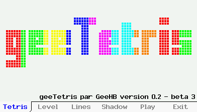

## *geeTetris* - Un jeu de tetris pour la Casio GRAPH90+E / FX-CG50

### Présentation

`geeTetris` est un jeu de tetris pour la calculatrice Casio Graph90+E développé en C++ sur `gint`. Il ne nécessite aucune librairie spécifique supplémentaires à l'exception de -lstdc++.

Il offre différentes options : affichage de l'ombre de la pièce, démarrage avec un handicap de lignes 'sales', démarrage sur un niveau plus rapide. Et il permet de jouer avec la calculatrice en mode horizontal (position standard) ou en mode vertical.

### Utilisation du clavier

Quel que soit le mode d'affichage choisi, vertical ou horizontal, les touches suivantes fonctionneront à l'identique à tout moment de la partie :

| Touche | Action |  
| --------------- |----------------|
|  | Changement de mode d'affichage. Par défaut l'affichage est en mode horizontal (calculatrice en mode normal), un appui transformera instantanément les affichages du jeu vers le mode vertical. Et réciproquement suite à un second appui.|
|  | Sortie du jeu |

#### Contrôles en mode horizontal

| Touche | Action |  
| --------------- |----------------|
|  | Déplacement de la pièce vers la gauche |
|  | Déplacement de la pièce vers la droite |
|  | Descente de la pièce d'un rang |
|  | Rotation de la pièce |
|  | Faire tomber la pièce le plus bas possible |

#### Contrôles en mode vertical

Les contrôles "suivent" le mouvement de la calculatrice :

| Touche | Action |  
| --------------- |----------------|
|  | Déplacement de la pièce vers la gauche |
|  | Déplacement de la pièce vers la droite |
|  | Descente de la pièce d'un rang |
|  | Rotation de la pièce |
|  | Faire tomber la pièce le plus bas possible |

### Captures

Ecran d'accueil de `geeTetris` :

Choix du nombre de ligne 'sales' à ajouter en début de partie :

Jeu en mode normal :

... la même partie continue en affichage vertical :
